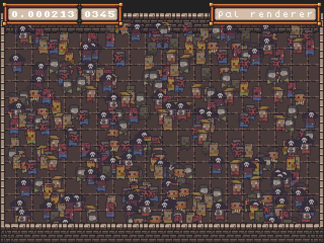

# SoftLK Engine

A software accelerated engine using OpenGL to bring the graphics to the screen. It's made for low resolutions (eg. 256x240), but should handle higher resolutions, too.

## Features

* Layers: Draw to multiple independent layers
* RGB drawing: Draw in 32bit rgba colorspace
* Pal drawing: Draw in palletized 8bit colorspace and change the palette on the fly, without needing to redraw
* Image loading: Load and save sprites from and to multiple file formats
* OpenGL 2.1: It's old. It's antiquated. I mean, who needs shaders anyway?

## License

SoftLK is free Software (as in freedom) and is released under the 3-clause BSD license, see LICENSE.md for details. Most of the examples are released under the same license, unless noted otherwise of course.

## Getting started

1. Get a compiler: I use gcc but clang works too.
2. Install the SDL2 development files:
	
	On Debian/Ubuntu: `` sudo apt install libsdl2-dev``  (Note: I haven't used a Debian/Ubuntu based distro in a while)

	On Void-Linux: `` sudo xbps-install  SDL2-devel``
3. Clone this repository: `` git clone --recursive https://codeberg.org/Captain4LK/SoftLK-lib.git``
4. Compile SoftLK: 
	
	You can either use the provided makefile (on freebsd please use gmake):

	```
	cd SoftLK-lib/lib/[YOUR OS]/
	make backend_sdl2_gl
	```

	Or compile it yourself:
	
	```	
	cd SoftLK-lib/lib/[YOUR OS]/
	gcc -O3 -c ../src/*.c ../src/backend/backend_sdl2_gl.c -lm -lSDL2 -lGL #Compile to object files first
	ar crs libSLK.a *.o #Then link them together
	```

5.  If everything went right you are now ready to start using SoftLK. Now you can either look at some of the examples, look at the [Getting started](https://codeberg.org/Captain4LK/SoftLK-lib/wiki/Getting-started) wikipage or figure things out yourself by looking at the source. 


## Plattforms

SoftLK has been tested and is working on the following plattforms/os:

* Void GNU/Linux, amd64
* FreeBSD 12.1, amd64

SoftLK should work on any plattform that has a C compiler, SDL2 and OpenGL 2.1, the plattforms listed here are just the ones I frequently test SoftLK on.

## Library Credits

Here I shall list all external libraries used by SoftLK:

* [SDL2](https://www.libsdl.org/) 
* [stb_image](https://github.com/nothings/stb/blob/master/stb_image.h)
* [stb_image_write](https://github.com/nothings/stb/blob/master/stb_image_write.h)
* [stb_rect_pack](https://github.com/nothings/stb/blob/master/stb_rect_pack.h)

## Gallery




