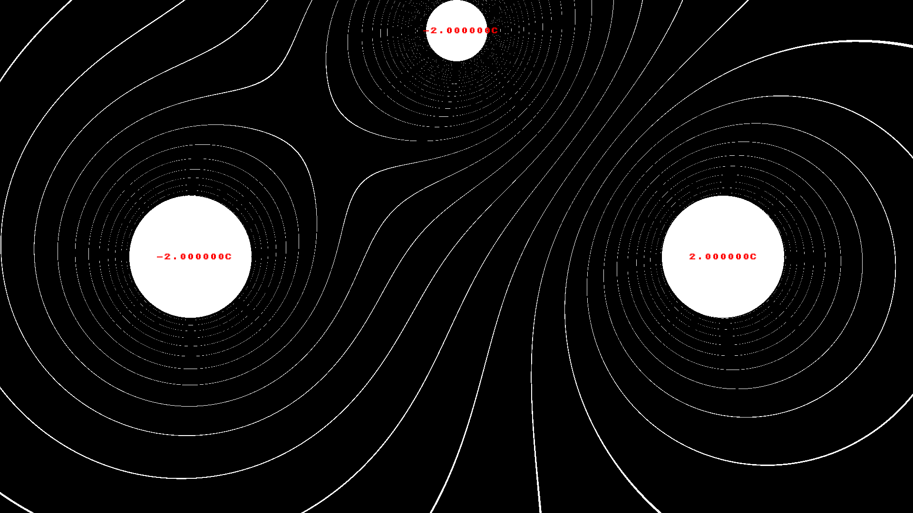

# SoftLK Engine

A software accelerated engine that uses OpenGL to bring the graphics to the screen. It's made for low resolutions (eg. 256x240), but can be used for higher resolutions, too.

## Features

* Layers: Draw to multiple independent layers
* RGB drawing: Draw in 32bit rgba colorspace
* Pal drawing: Draw in palletized 8bit colorspace and change the palette on the fly, without needing to redraw
* Image loading: Load and save from and to multiple file formats
* OpenGL 2.1: It's old. It's antiquated. I mean, who needs shaders anyway?

## License

SoftLK is free Software (as in freedom) and is released under the 3-clause BSD license, see LICENSE.md for details. Most of the examples are released under the same license, unless noted otherwise of course.

## Using SoftLK

To use SoftLK you need to have the following libraries installed:

* [SDL 2](https://www.libsdl.org/)

You need to link your programm to the following libraries:

Linux:

* -lSDL2
* -lGL
* -ldl

## Plattforms

SoftLK has been tested and is working on the following plattforms/os:

* Void GNU/Linux, amd64: [Enter the void](https://voidlinux.org/) 
* Raspbian 10, raspberry pi 4b: [Teach, learn and make](https://www.raspberrypi.org/)

SoftLK should work on any plattform that has a C compiler, SDL2 and OpenGL 2.1, the plattforms listed here are just the ones I frequently test SoftLK on.

## Library Credits

* [stb_image](https://github.com/nothings/stb/blob/master/stb_image.h)
* [stb_image_write](https://github.com/nothings/stb/blob/master/stb_image_write.h) 

## Gallery

