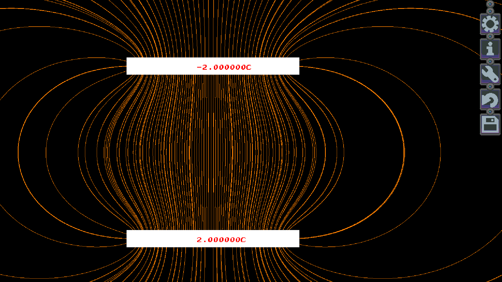

# SoftLK-lib

A library trying to make graphics in game development (simulations etc.) easy. It is using software rendering (but using OpenGL on the default backend) and tries to be as portable as possible.

## Features

What it does:

* Layers: Draw to multiple independent layers
* RGB drawing: Draw in 32bit rgba colorspace
* Pal drawing: Draw in palletized 8bit colorspace and change the palette on the fly, without needing to redraw
* Image loading: Load and save sprites from and to multiple file formats
* Backends: Plattform specific code is seperate from general code, however only an SDL2 backend has been implemented yet.
* Input: Gamepad, mouse and keyboard input.

What it doesn't:

* Sound: You need to bring your own audio library (eg. SDL_mixer)
* Asset managment: It can load multiple image formats, but managing what should or should'nt be loaded is up to you.
* typical engine stuff in general: SoftLK tries to be integrable into many different kinds of projects by not restricting the programmer too much.

## License

SoftLK is free Software (as in freedom) and is released under the 3-clause BSD license, see LICENSE.md for details. Most of the examples are released under the same license, unless noted otherwise of course.

## Getting started

1. Get a compiler: I recommend gcc but clang works too.
2. Install the SDL2 development files:
	
	On Debian/Ubuntu: `` sudo apt install libsdl2-dev``  (Note: I haven't used a Debian/Ubuntu based distro in a while)

	On Void-Linux: `` sudo xbps-install  SDL2-devel``
3. Clone this repository: `` git clone --recursive https://codeberg.org/Captain4LK/SoftLK-lib.git``
4. Compile SoftLK: 
	
	You can either use the provided makefile (on freebsd please use gmake):

	```
	cd SoftLK-lib/lib/[YOUR OS]/
	make backend_sdl2_gl
	```

	Or compile it yourself:
	
	```	
	cd SoftLK-lib/lib/[YOUR OS]/
	gcc -O3 -c ../../src/*.c ../../src/backend/backend_sdl2_gl.c -lm -lSDL2 -lGL #Compile to object files first
	ar crs libSLK.a *.o #Then link them together
	```

5.  If everything went right you are now ready to start using SoftLK. Now you can either look at some of the examples, look at the [Getting started](https://codeberg.org/Captain4LK/SoftLK-lib/wiki/Getting-started) wikipage or figure things out yourself by looking at the source. 


## Plattforms

SoftLK has been tested and is working on the following plattforms/os:

* Void GNU/Linux, amd64
* FreeBSD 12.1, amd64

SoftLK should work on any plattform that has a C compiler, SDL2 and OpenGL 2.1, the plattforms listed here are just the ones I frequently test SoftLK on.

## Library Credits

Here is a list of all external libraries used by SoftLK:

* [SDL2](https://www.libsdl.org/) 
* [stb_image](https://github.com/nothings/stb/blob/master/stb_image.h)
* [stb_image_write](https://github.com/nothings/stb/blob/master/stb_image_write.h)

## Gallery



