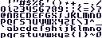
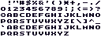
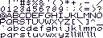
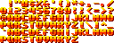

# Asset credits/collection

Here is a list of all assets used by SoftLK and its examples.

## Fonts

Not all fonts listed here are actively used in the examples, but they can be found in the data/fonts directory and used by you.

### Normal fonts

|File name|Image|License|Source/Author|
|---|---|---|---|
|techno.png||[CC0/public domain](https://creativecommons.org/publicdomain/zero/1.0/)|[usr_share](https://opengameart.org/content/new-original-grafx2-font-collection)|
|solar.png||[CC0/public domain](https://creativecommons.org/publicdomain/zero/1.0/)|[usr_share](https://opengameart.org/content/new-original-grafx2-font-collection)|
|cursive1.png||[CC0/public domain](https://creativecommons.org/publicdomain/zero/1.0/)|[usr_share](https://opengameart.org/content/new-original-grafx2-font-collection)|
|cursive2.png||[CC0/public domain](https://creativecommons.org/publicdomain/zero/1.0/)|[usr_share](https://opengameart.org/content/new-original-grafx2-font-collection)|
|5x8mono.png||[CC0/public domain](https://creativecommons.org/publicdomain/zero/1.0/)|[usr_share](https://opengameart.org/content/new-original-grafx2-font-collection)|

### Image fonts

|File name|Image|License|Source/Author|
|---|---|---|---|
|SaikyoBlack.png||[CC0/public domain](https://creativecommons.org/publicdomain/zero/1.0/)|[usr_share](https://opengameart.org/content/new-original-grafx2-font-collection)|

------------
## Assets used in examples

### Resize

|File name|License|Source/Author|
|---|---|---|
|assets/image.slk|[CC0/public domain](https://creativecommons.org/publicdomain/zero/1.0/)|Captain4LK|

### Performance

|File name|License|Source/Author|
|---|---|---|
|assets/gui_00.png|[CC0/public domain](https://creativecommons.org/publicdomain/zero/1.0/)|[0x72](https://0x72.itch.io/dungeonui)|
|assets/gui_01.png|[CC0/public domain](https://creativecommons.org/publicdomain/zero/1.0/)|[0x72](https://0x72.itch.io/dungeonui)|
|assets/gui_02.png|[CC0/public domain](https://creativecommons.org/publicdomain/zero/1.0/)|[0x72](https://0x72.itch.io/dungeontileset-ii)|
|assets/gui_03.png|[CC0/public domain](https://creativecommons.org/publicdomain/zero/1.0/)|[0x72](https://0x72.itch.io/dungeontileset-ii)|
|assets/sprites.png|[CC0/public domain](https://creativecommons.org/publicdomain/zero/1.0/)|[0x72](https://0x72.itch.io/pixeldudesmaker)|

### Efelder

|File name|License|Source/Author|
|---|---|---|
|assets/gui.png [GUI]|[CC0/public domain](https://creativecommons.org/publicdomain/zero/1.0/)|[Buch](https://opengameart.org/content/unfinished-user-interfaces)|
|assets/gui.png [FONT]|[CC0/public domain](https://creativecommons.org/publicdomain/zero/1.0/)|[Buch](https://opengameart.org/content/three-little-bitmap-fonts)|

### Gui

|File name|License|Source/Author|
|---|---|---|
|assets/sprites.png|[CC0/public domain](https://creativecommons.org/publicdomain/zero/1.0/)|[0x72](https://0x72.itch.io/pixeldudesmaker)|
|assets/buttons.png|[CC0/public domain](https://creativecommons.org/publicdomain/zero/1.0/)|[domsson](https://opengameart.org/content/simple-pixel-gui-programmer-art)|

-----
