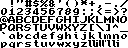

# Asset credits/collection

Here is a list of all assets used by SoftLK and its examples.

## Fonts

Not all fonts listed here are actively used in the examples, but they can be found in the data/fonts directory and used by you.

|File name|Image|License|Source|
|---|---|---|---|
|techno.png||CC0/public domain|[usr_share](https://opengameart.org/content/new-original-grafx2-font-collection)
|solar.png||CC0/public domain|[usr_share](https://opengameart.org/content/new-original-grafx2-font-collection)
|cursive1.png||CC0/public domain|[usr_share](https://opengameart.org/content/new-original-grafx2-font-collection)
|cursive2.png||CC0/public domain|[usr_share](https://opengameart.org/content/new-original-grafx2-font-collection)