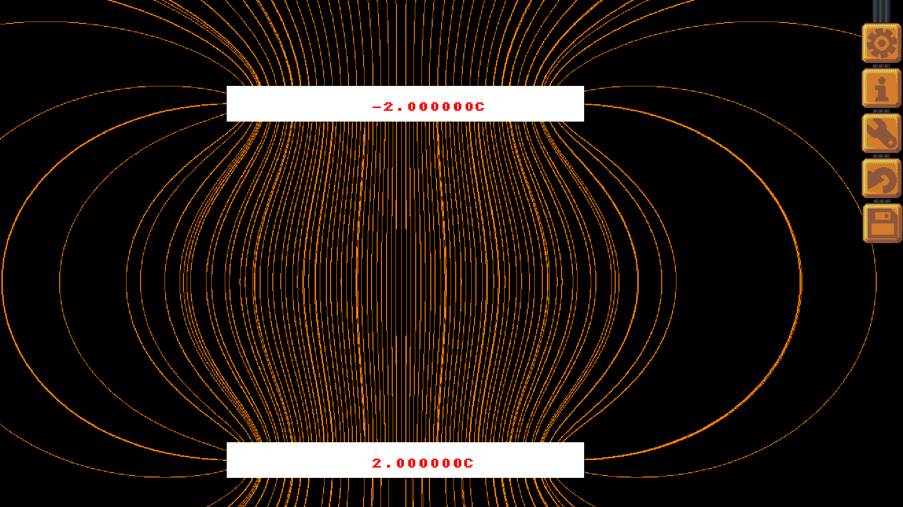

# Efelder

This is a simple tool for simulating and visualising the electric fields and potential of shapes.



This semi-small program has originally been written for my seminar paper and is released under the terms of the GNU General Public License v3.

In the program itself you can just press the information button (the one with an i) to acess a simple explanation of this program. It is however not currently finished. While most of the essential features are implemented, some other, big features like an editor are planned (and a button reserved) but not implemented yet.

## How to compile

If you are on linux and have gcc installed you can just use the provided shell script to compile this example, otherwise you can compile it like this (again, clang should work too):


```
gcc -O3 -o resize *.c ../../lib/libSLK.a -lm -lSDL2 -lGL  -Wall #Compile to executable
chmod +x ./resize #Only needed on unix(-like) systems
```
