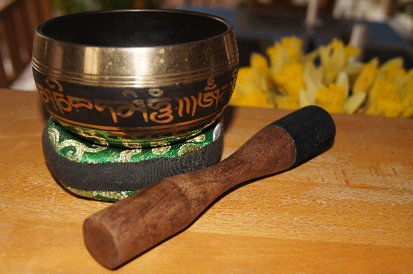
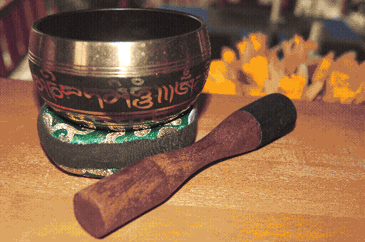

# SLK_converter

a tool for converting regular image files to the image format used by SLK pal drawing.

## Arguments

* `-h` show a help text
* `-i [FILE]` input image files (png, jpg etc)
* `-o [DIRECTORY]` output directory for images
* `-f [FORMAT]` output image format, either png or slk
* `-d [LEVEL]` dithering level, NONE, SOME or NORMAL
* `-p [PATH]` palette path, optional, will use rgb332 palette by default

## Notes

* currently slk_converter will not automaticaly create a palette from a image, you need to either use the default palette or use your own.
* [lospec](https://lospec.com/palette-list) has a nice collection of palettes

## Example

### Using [aap-64](https://lospec.com/palette-list/aap-64) palette:

input:

output:

